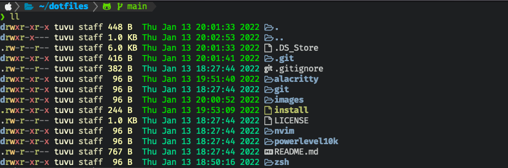

# dotfiles

My dotfiles for alarcritty, zsh, neovim. Managed by [GNU Stow](https://www.gnu.org/software/stow/).

## Todo

- [ ] Fix [null-ls](https://github.com/jose-elias-alvarez/null-ls.nvim) auto imports in React
- [ ] Add [ Lua LSP ](https://github.com/sumneko/lua-language-server)
- [ ] Modularize lsp folder into handlers and installer

## Installation

### Using Git

```
git clone https://github.com/tu-vu/dotfiles.git && cd dotfiles && ./install
```

### Lua

First, build the latest version of [Lua](https://www.lua.org/) from source:

```
curl -R -O http://www.lua.org/ftp/lua-5.4.3.tar.gz
tar zxf lua-5.4.3.tar.gz
cd lua-5.4.3
make all test
```

Then install Lua: `make install`.

### Cargo - Rust package manager

```
`curl https://sh.rustup.rs -sSf | sh`
cargo install lsd --boost ls command
cargo install stylua --Lua code formatter
```

### Neovim plugins

Open [packer](https://github.com/wbthomason/packer.nvim) with nvim then run
`:PackerInstall`.
